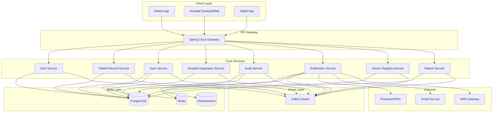
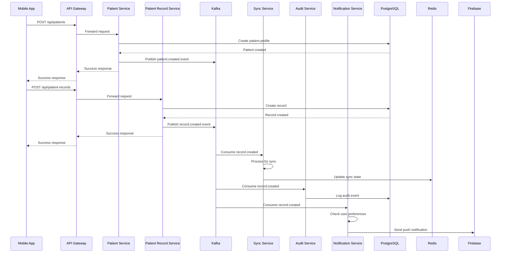
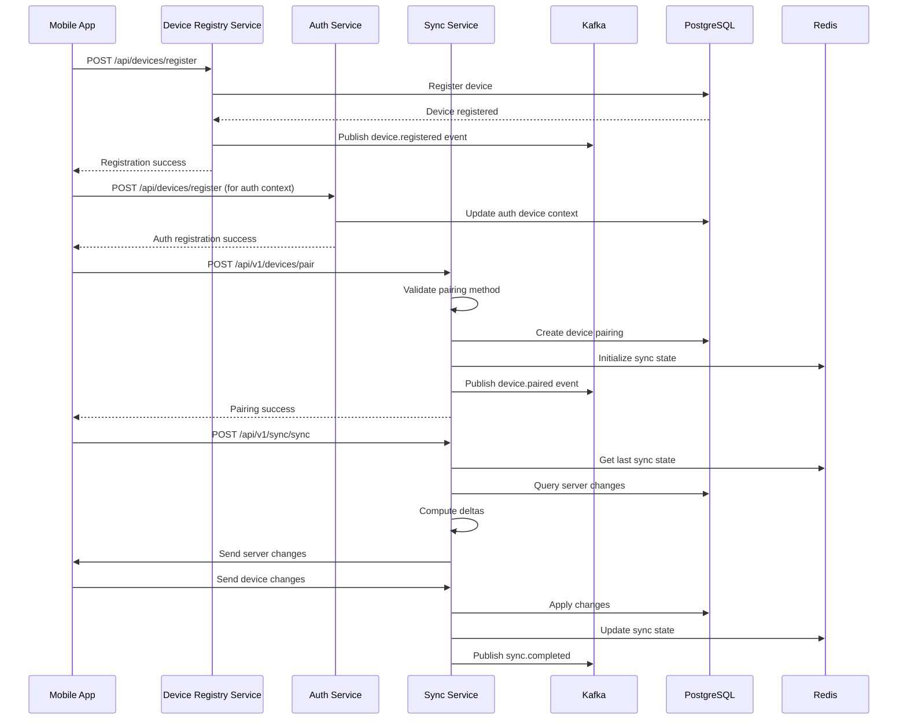
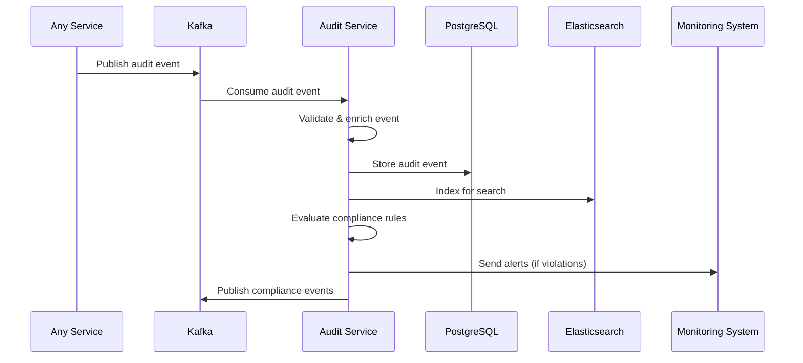

# EMR Backend Architecture Documentation

## 1. System Overview

The Mayo EMR (Electronic Medical Record) system is a production-grade, offline-first backend architecture designed to support patients via mobile applications and healthcare providers via desktop/web interfaces. The system enables bidirectional synchronization of medical records across devices while maintaining data consistency, security, and compliance with healthcare regulations.

### Key Characteristics
- **Offline-First Design**: Supports full functionality without internet connectivity
- **Multi-Device Synchronization**: Seamless data sync between mobile apps, hospital desktops, and tablets
- **National Scale**: Designed for country-wide deployment with regional data residency
- **Compliance-Focused**: Built-in audit trails, encryption, and regulatory reporting
- **Microservices Architecture**: Modular, scalable services with event-driven communication

### Core Capabilities
- Patient record management with versioning and ownership transfers
- Real-time bidirectional synchronization with conflict resolution
- Hospital device integration and data transfer protocols
- Comprehensive audit logging and compliance monitoring
- Multi-channel notifications (push, email, SMS)
- User authentication and authorization with device pairing

## 2. Service Architecture

The EMR backend is composed of eight core microservices, each responsible for specific business domains:

### 2.1 Audit Service
**Purpose**: Comprehensive audit logging, compliance monitoring, and regulatory reporting.

**Key Features**:
- Event-driven audit logging from all services
- Elasticsearch integration for fast search and aggregation
- Compliance rule engine with automated alerting and configurable rules for HIPAA, GDPR, and other frameworks
- Data retention and archival policies
- Multi-geo deployment support

**Technology Stack**: Spring Boot, PostgreSQL, Elasticsearch, Kafka

**API Endpoints**:
- `GET /api/audit/events` - Query audit events with filtering
- `GET /api/audit/events/search` - Elasticsearch-based search
- `GET /api/audit/statistics` - Audit statistics and reporting

### 2.2 Auth Service
**Purpose**: User authentication, authorization, and device management.

**Key Features**:
- JWT-based authentication with refresh tokens
- Multi-factor authentication support
- Device registration and pairing
- Role-based access control (RBAC)
- Ghana Card integration for national authentication
- Context-aware authentication combining user credentials, device validation, certificates, and API keys for multi-factor security

**Technology Stack**: Spring Security, PostgreSQL, Redis

**API Endpoints**:
- `POST /api/auth/login` - User authentication
- `POST /api/devices/register` - Device registration
- `GET /api/devices/my-devices` - List user devices

### 2.3 Hospital Integration Service
**Purpose**: Hospital device registration, access verification, and data transfer protocols.

**Key Features**:
- Hospital and device registration management
- Full protocol adapters supporting HL7 v2/v3, FHIR R4/R5, and DICOM with automatic data transformation and validation
- Activity logging and monitoring
- Heartbeat tracking for device connectivity
- Integration with hospital information systems

**Technology Stack**: Spring Boot, PostgreSQL, Kafka

**API Endpoints**:
- `POST /api/v1/hospitals` - Register hospitals
- `POST /api/v1/devices/register` - Register hospital devices
- `POST /api/v1/devices/{deviceId}/heartbeat` - Device heartbeat

### 2.4 Notification Service
**Purpose**: Multi-channel notification delivery to patients and healthcare providers.

**Key Features**:
- Push notifications via FCM/APNs
- Email and SMS fallbacks
- User preference management
- Template-based message rendering with localization
- Delivery tracking and retry mechanisms

**Technology Stack**: Spring Boot, PostgreSQL, Redis, Firebase/APNs

**API Endpoints**:
- `POST /api/v1/notifications/send` - Send notifications
- `PUT /api/v1/notifications/preferences/{userId}` - Update preferences
- `GET /api/v1/notifications/history/{userId}` - Notification history

### 2.5 Patient Record Service
**Purpose**: CRUD operations for patient records, medical data management, and ownership transfers.

**Key Features**:
- Patient profile and record management
- Medical data types: lab results, imaging studies, vital signs, medications, allergies
- Record versioning and conflict resolution
- Family account ownership transfers
- Comprehensive medical history tracking

**Technology Stack**: Spring Boot, PostgreSQL, Kafka

**API Endpoints**:
- `POST /api/patients` - Create patient profiles
- `POST /api/patient-records` - Create medical records
- `POST /api/patients/{patientId}/transfer-ownership` - Initiate ownership transfer

### 2.6 Sync Service
**Purpose**: Bidirectional synchronization of patient records across devices with conflict resolution.

**Key Features**:
- Delta syncing for efficient data transfer
- CRDT-based synchronization with conflict-free replicated data types for automatic conflict resolution and offline-first capabilities
- Device pairing via Bluetooth/WiFi/USB
- Real-time sync via gRPC streaming
- Sync state management and versioning

**Technology Stack**: Spring Boot, PostgreSQL, Redis, Kafka, gRPC

**API Endpoints**:
- `POST /api/v1/devices/pair` - Pair devices
- `POST /api/v1/sync/sync` - Perform synchronization
- `GET /api/v1/conflicts` - List sync conflicts

### 2.7 Device Registry Service
**Purpose**: Device registration, management, and validation for secure device integration.

**Key Features**:
- Device registration and lifecycle management
- Device authentication and authorization
- Device pairing and connectivity monitoring
- Protocol validation and security enforcement
- Integration with hospital systems for device verification

**Technology Stack**: Spring Boot, PostgreSQL, Kafka

**API Endpoints**:
- `POST /api/devices/register` - Register new device
- `GET /api/devices/{deviceId}` - Get device details
- `PUT /api/devices/{deviceId}/status` - Update device status

### 2.8 Patient Service
**Purpose**: Patient profile management, demographics, and patient lifecycle operations.

**Key Features**:
- Patient registration and profile management
- Demographic data handling
- Patient identity verification and matching
- Family account management and ownership transfers
- Patient consent and privacy management

**Technology Stack**: Spring Boot, PostgreSQL, Kafka

**API Endpoints**:
- `POST /api/patients` - Create patient profile
- `GET /api/patients/{patientId}` - Get patient details
- `PUT /api/patients/{patientId}` - Update patient profile
- `POST /api/patients/{patientId}/consent` - Manage patient consent

## 3. Data Flow Diagrams

### 3.1 Overall System Architecture

### 3.2 Patient Record Creation and Sync Flow

### 3.3 Device Pairing and Synchronization Flow

### 3.4 Audit and Compliance Monitoring Flow

## 4. Technology Stack

### Core Framework
- **Spring Boot 3.x**: Enterprise-grade Java framework for microservices
- **Spring Cloud**: Service discovery, configuration, and gateway
- **Spring Security**: Authentication and authorization
- **Spring Data JPA**: Database access layer

### Data Storage
- **PostgreSQL**: Primary relational database for structured data
- **Redis**: In-memory caching and session management
- **Elasticsearch**: Full-text search and analytics for audit data

### Messaging and Events
- **Apache Kafka**: Event streaming platform for service communication
- **gRPC**: High-performance RPC for real-time sync operations

### Security
- **JWT**: Token-based authentication
- **AES-256**: Data encryption at rest and in transit
- **TLS 1.3**: Secure communication channels
- **OAuth 2.0/OpenID Connect**: External authentication integration

### External Integrations
- **Firebase Cloud Messaging (FCM)**: Push notifications for Android
- **Apple Push Notification Service (APNs)**: Push notifications for iOS
- **SendGrid/Twilio**: Email and SMS delivery

### Infrastructure
- **Kubernetes**: Container orchestration
- **Docker**: Containerization
- **Helm**: Kubernetes package management
- **Istio**: Service mesh for traffic management

### Monitoring and Observability
- **Prometheus**: Metrics collection
- **Grafana**: Visualization and alerting
- **ELK Stack**: Centralized logging
- **Jaeger**: Distributed tracing

## 5. Integration Patterns

### 5.1 REST APIs
**Usage**: External client communication, service-to-service calls
**Implementation**: Spring Web MVC with OpenAPI/Swagger documentation
**Authentication**: JWT bearer tokens
**Content Type**: JSON with standardized response format

### 5.2 Event-Driven Architecture
**Usage**: Asynchronous service communication, audit logging, notifications
**Implementation**: Apache Kafka with Spring Kafka
**Event Types**:
- Domain events (patient.record.created, device.paired)
- Integration events (sync.completed, audit.logged)
- System events (health.check, metrics)

### 5.3 gRPC Streaming
**Usage**: Real-time bidirectional synchronization
**Implementation**: gRPC with protocol buffers
**Features**: Streaming for continuous sync, bidirectional communication

### 5.4 Database Integration
**Usage**: Data persistence and querying
**Implementation**: Spring Data JPA with PostgreSQL
**Patterns**: Repository pattern, optimistic locking for concurrency

### 5.5 External Service Integration
**Usage**: Push notifications, email/SMS delivery
**Implementation**: REST APIs with circuit breaker pattern
**Resilience**: Retry mechanisms, fallback strategies

## 6. Scalability Considerations

### 6.1 Horizontal Scaling
- **Microservices Design**: Independent scaling of services based on load
- **Database Sharding**: Partition data by user/region for massive scale
- **Kafka Partitioning**: Distribute events across multiple brokers
- **Redis Clustering**: Distributed caching for high availability

### 6.2 Performance Optimization
- **Caching Strategy**: Redis for frequently accessed data (user sessions, sync states)
- **Database Indexing**: Optimized indexes for common query patterns
- **Async Processing**: Non-blocking operations for high throughput
- **Connection Pooling**: Efficient database and external service connections

### 6.3 Multi-Region Deployment
- **Data Residency**: Regional databases for compliance (Ghana, EU, US)
- **Cross-Region Replication**: Asynchronous data sync between regions
- **Geo-DNS**: Route users to nearest region
- **Failover**: Automatic failover between regions

### 6.4 Capacity Planning
- **Concurrent Users**: Support for 100,000+ simultaneous users
- **Data Volume**: Petabyte-scale storage with efficient archiving
- **Throughput**: 10,000+ sync operations per second
- **Latency**: <100ms for API responses, <5 seconds for sync completion

### 6.5 Monitoring and Auto-Scaling
- **Metrics Collection**: Application and infrastructure metrics
- **Auto-Scaling**: Kubernetes HPA based on CPU/memory usage
- **Load Balancing**: Distribute traffic across service instances
- **Circuit Breakers**: Prevent cascade failures

### 6.6 Disaster Recovery
- **Backup Strategy**: Daily backups with point-in-time recovery
- **Multi-AZ Deployment**: High availability across availability zones
- **Data Archival**: Long-term storage with compliance retention
- **Failover Testing**: Regular DR drills and automated testing

This architecture provides a robust, scalable foundation for the EMR system, supporting national-scale operations while maintaining data security, compliance, and user experience.