# EMR Backend Service Interaction Diagrams

This document provides detailed service interaction diagrams for the Mayo EMR backend system, showing how microservices communicate through APIs, events, and data synchronization patterns.

## 1. Patient Record Creation and Sync

### Component Diagram

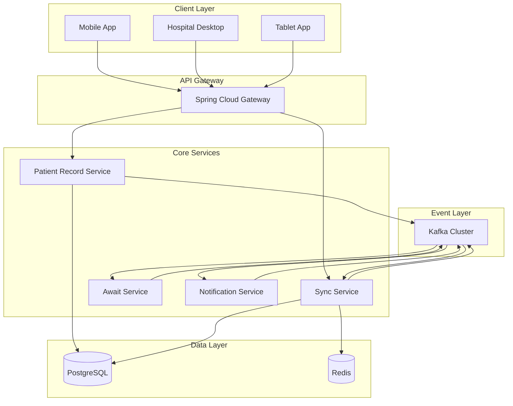

### Sequence Diagram - Patient Record Creation

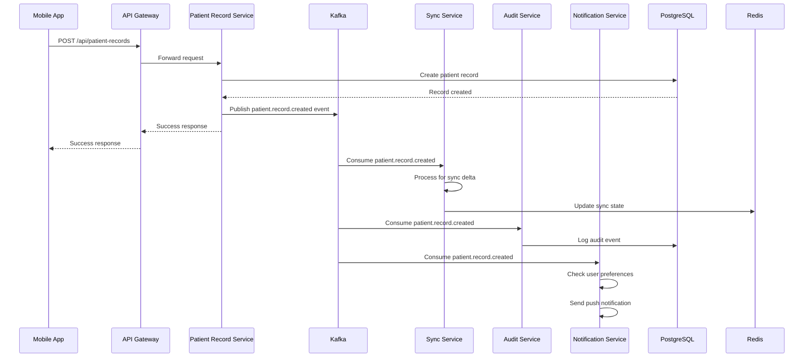

### Sequence Diagram - Patient Record Sync

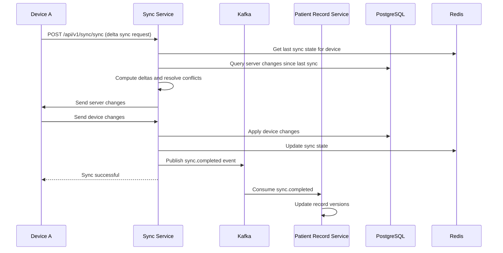

## 2. Device Authentication

### Component Diagram

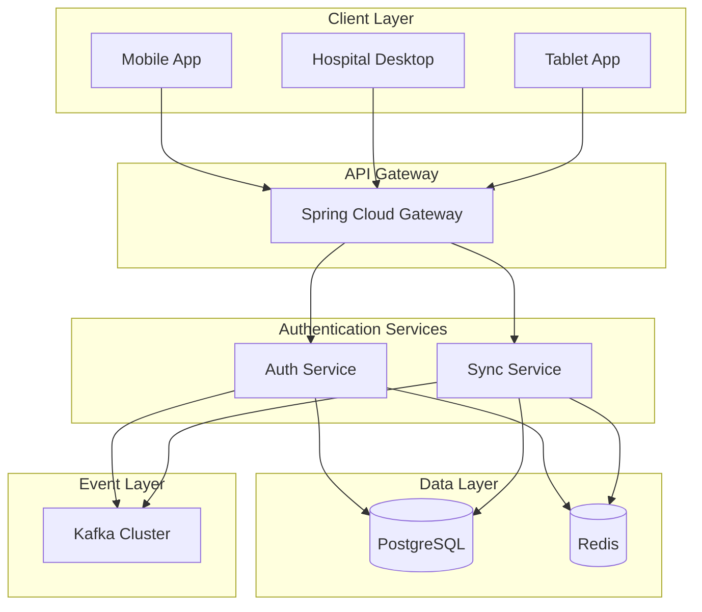

### Sequence Diagram - Device Registration and Authentication

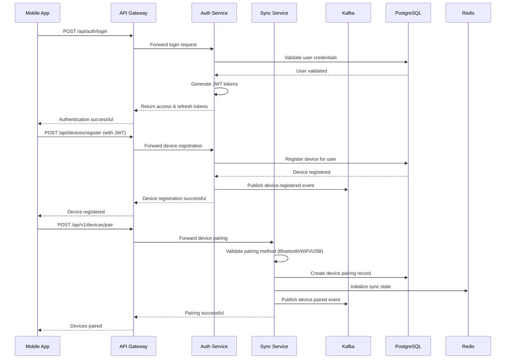

## 3. Notification Flows

### Component Diagram

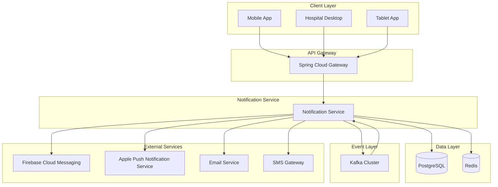

### Sequence Diagram - Notification Delivery Flow

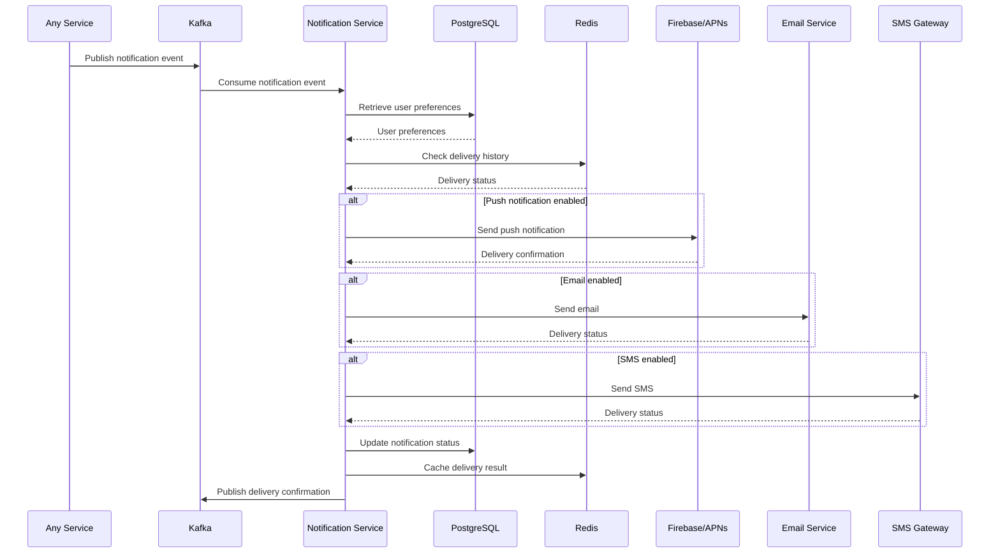

### Sequence Diagram - Notification Preferences Management

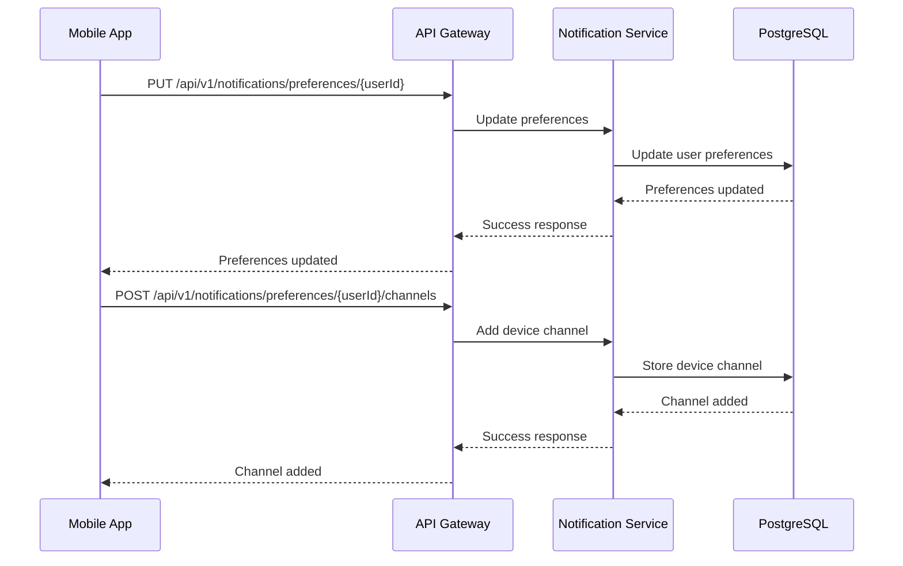

## 4. Audit Logging

### Component Diagram

```mermaid
graph TB
    subgraph "All Services"
        AuthSvc[Auth Service]
        PatientSvc[Patient Record Service]
        SyncSvc[Sync Service]
        HospitalSvc[Hospital Integration Service]
        NotificationSvc[Notification Service]
    end

    subgraph "Audit Service"
        AuditSvc[Await Service]
        AuditConsumer[Await Event Consumer]
        ComplianceEngine[Compliance Rule Engine]
        AlertSvc[Alert Service]
    end

    subgraph "Data Layer"
        Postgres[(PostgreSQL)]
        ES[(Elasticsearch)]
    end

    subgraph "Event Layer"
        Kafka[Kafka Cluster]
    end

    subgraph "Monitoring"
        Monitoring[Monitoring System]
    end

    AuthSvc --> Kafka
    PatientSvc --> Kafka
    SyncSvc --> Kafka
    HospitalSvc --> Kafka
    NotificationSvc --> Kafka

    Kafka --> AuditConsumer
    AuditConsumer --> AuditSvc
    AuditSvc --> Postgres
    AuditSvc --> ES
    AuditSvc --> ComplianceEngine
    ComplianceEngine --> AlertSvc
    AlertSvc --> Monitoring
    AlertSvc --> Kafka
```

### Sequence Diagram - Audit Event Processing

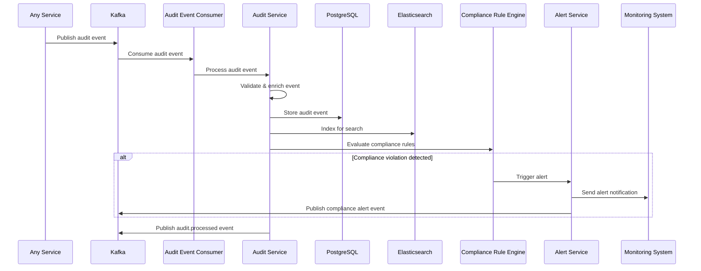

### Sequence Diagram - Audit Query and Reporting

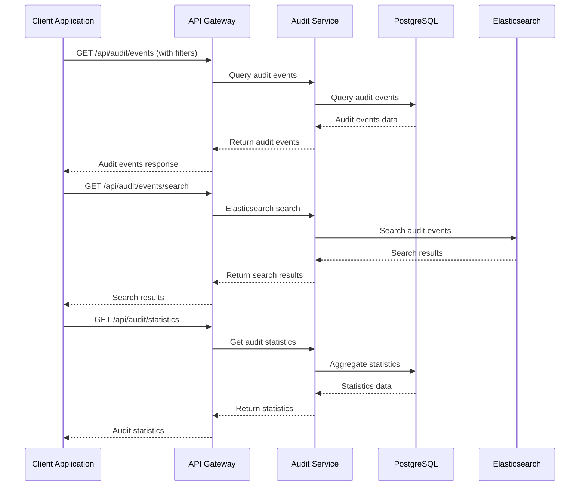

## 5. Hospital Integration

### Component Diagram

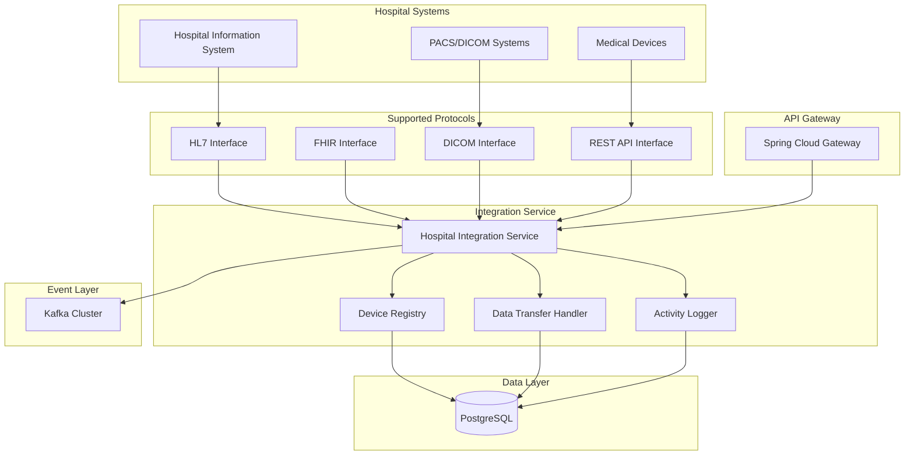

### Sequence Diagram - Hospital Device Registration

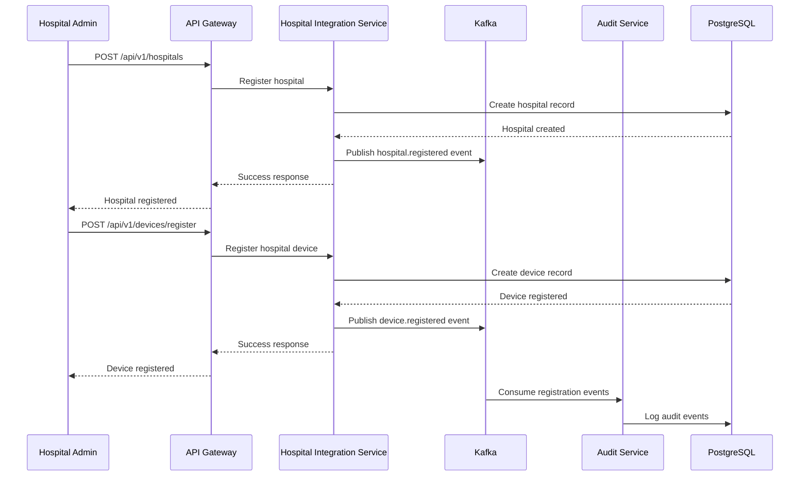

### Sequence Diagram - Data Transfer from Hospital Device

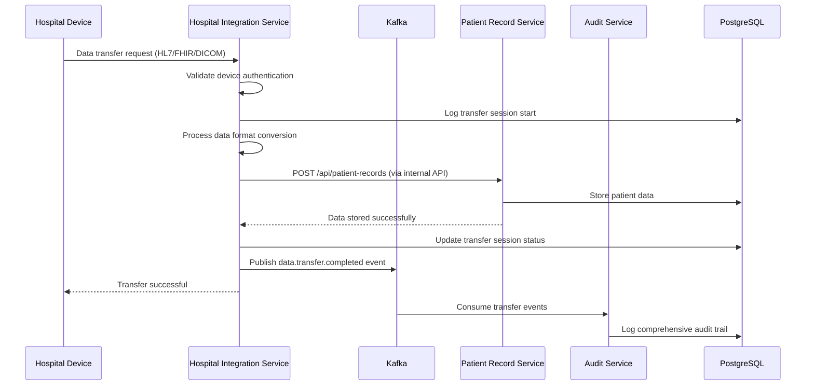

### Sequence Diagram - Device Heartbeat and Monitoring

```mermaid
sequenceDiagram
    participant Device as Hospital Device
    participant HospitalSvc as Hospital Integration Service
    participant Kafka as Kafka
    participant Monitoring as Monitoring System
    participant Postgres as PostgreSQL

    Device->>HospitalSvc: POST /api/v1/devices/{deviceId}/heartbeat
    HospitalSvc->>Postgres: Update device last seen
    Postgres-->>HospitalSvc: Heartbeat recorded
    HospitalSvc->>HospitalSvc: Check device health status
    HospitalSvc->>Kafka: Publish device.heartbeat event
    HospitalSvc-->>Device: Heartbeat acknowledged

    Kafka->>Monitoring: Consume heartbeat events
    Monitoring->>Monitoring: Update device status dashboard

    alt Device offline threshold exceeded
        Monitoring->>Monitoring: Trigger offline alert
        Monitoring->>Kafka: Publish device.offline alert
    end