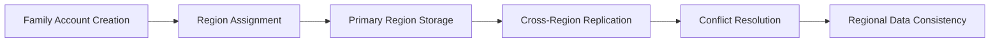
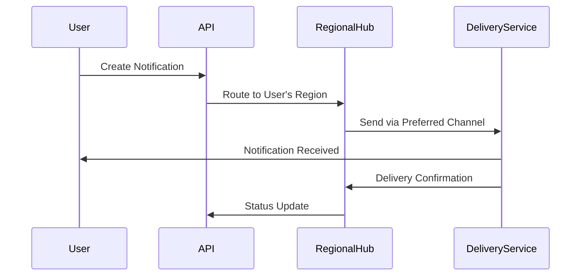
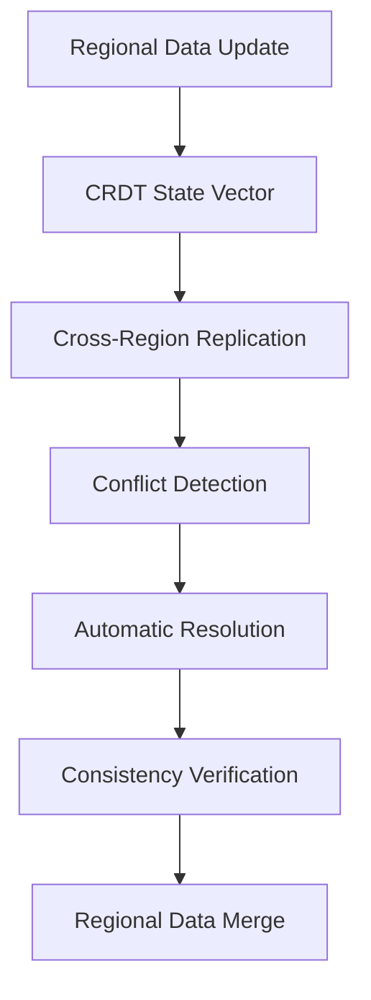

# Multi-Geo Infrastructure Implementation Summary

## Executive Summary

This document provides a comprehensive summary of the multi-region infrastructure design for the EMR backend system, ensuring national-scale deployment across Ghana with support for all Phase 2 features. The architecture delivers low-latency, high-availability healthcare services while maintaining regulatory compliance and cost efficiency.

## Architecture Overview

### Regional Deployment Strategy

**Primary Regions:**
- **Accra**: Primary control plane and coordination
- **Kumasi**: Secondary region with full service replication
- **Takoradi**: Tertiary region with critical service replication
- **Tamale**: Quaternary region with essential service replication

**Deployment Topology:**
- **Active-Active**: All regions serve traffic simultaneously
- **Geo-Aware Routing**: Latency-based traffic distribution
- **Automatic Failover**: Seamless regional failover capabilities

### Technology Stack

| Component | Technology | Regional Configuration |
|-----------|------------|------------------------|
| **Orchestration** | Kubernetes | Multi-cluster federation |
| **Database** | PostgreSQL + Citus | Geo-sharding with replication |
| **Caching** | Redis Enterprise | Multi-region clustering |
| **Messaging** | Kafka | Multi-region mirroring |
| **API Gateway** | Spring Cloud Gateway | Geo-aware routing |
| **CDN** | Cloudflare | Multi-region acceleration |
| **Monitoring** | Prometheus + Grafana | Multi-region observability |
| **Backup** | Velero | Multi-region disaster recovery |

## Phase 2 Features Support

### 1. Family Accounts and Transfers

**Multi-Region Implementation:**
- **Geo-Sharded Family Data**: Family records stored in primary user's region
- **Cross-Region Transfers**: Asynchronous replication with conflict resolution
- **Regional Consistency**: CRDT-based merge strategies for family data

**Architecture:**


**Implementation Details:**
- **Family Service**: Regional deployment with cross-region synchronization
- **Transfer Protocol**: Event-driven transfer with validation
- **Data Locality**: Family data stored closest to primary users
- **Audit Trail**: Complete transfer history with regional timestamps

### 2. Audit and Compliance

**Regional Compliance Framework:**
- **Regional Audit Trails**: Separate logs per region with aggregation
- **Automated Compliance**: Regional-specific rule enforcement
- **Immutable Logging**: Write-once storage with cryptographic hashing

**Compliance Matrix:**

| Region | Regulations | Data Residency | Encryption | Retention |
|--------|-------------|----------------|------------|-----------|
| Accra | Ghana Data Protection Act 2012 | Required | AES-256 | 7 years |
| Kumasi | Ghana Data Protection Act 2012 | Required | AES-256 | 7 years |
| Takoradi | Ghana Data Protection Act 2012 | Required | AES-256 | 7 years |
| Tamale | Ghana Data Protection Act 2012 | Required | AES-256 | 7 years |

**Implementation:**
- **Audit Service**: Regional deployment with cross-region aggregation
- **Compliance Engine**: Rule-based validation per region
- **Data Residency Controls**: Automatic enforcement of regional storage

### 3. Notifications System

**Multi-Region Notification Architecture:**
- **Regional Notification Hubs**: Localized processing
- **Geo-Targeted Alerts**: Region-specific routing
- **Multi-Channel Delivery**: SMS, email, push with regional preferences

**Notification Flow:**


**Implementation:**
- **Notification Service**: Regional deployment with local queues
- **Channel Preferences**: Regional channel prioritization
- **Delivery Optimization**: Local delivery endpoints

### 4. CRDTs Implementation

**Multi-Region Conflict Resolution:**
- **Regional CRDTs**: Conflict-free replicated data types
- **Eventual Consistency**: Multi-region synchronization
- **Offline-First**: Enhanced delta sync with regional awareness

**CRDT Architecture:**


**Implementation:**
- **Sync Service**: Enhanced with CRDT conflict resolution
- **State Vectors**: Regional state tracking
- **Merge Strategies**: Last-write-wins, operational transforms
- **Validation**: Cross-region consistency checks

## Infrastructure Components

### 1. Kubernetes Multi-Region Deployment

**Cluster Configuration:**
- **Primary Cluster (Accra)**: 12 nodes (4x control plane, 8x worker)
- **Secondary Clusters**: 6 nodes each (2x control plane, 4x worker)
- **Auto-Scaling**: Horizontal and vertical scaling per region

**Deployment Strategy:**
```yaml
# Regional deployment template
apiVersion: apps/v1
kind: Deployment
metadata:
  name: auth-service
  namespace: mayo-emr
spec:
  replicas: 3
  strategy:
    rollingUpdate:
      maxSurge: 1
      maxUnavailable: 0
  template:
    spec:
      affinity:
        nodeAffinity:
          requiredDuringSchedulingIgnoredDuringExecution:
            nodeSelectorTerms:
            - matchExpressions:
              - key: topology.kubernetes.io/region
                operator: In
                values:
                - accra
```

### 2. PostgreSQL Geo-Sharding

**Citus Configuration:**
- **Primary Coordinator**: Accra region
- **Worker Nodes**: 3 per region
- **Sharding Strategy**: By geographic location

**Sharding Implementation:**
```sql
-- Create geo-distributed tables
SELECT create_distributed_table('patients', 'region');
SELECT create_distributed_table('medical_records', 'patient_id', 'hash');

-- Add regional workers
SELECT master_add_node('mayo-postgres-kumasi-0', 5432);
SELECT master_add_node('mayo-postgres-takoradi-0', 5432);
```

### 3. Redis Multi-Region Clustering

**Cluster Topology:**
- **Primary Cluster**: 6 nodes in Accra
- **Regional Clusters**: 3 nodes each in secondary regions
- **Cross-Region Replication**: Asynchronous with conflict resolution

**Cluster Configuration:**
```yaml
apiVersion: app.redislabs.com/v1alpha1
kind: RedisEnterpriseDatabase
metadata:
  name: mayo-cache
spec:
  multiRegionConfiguration:
    enabled: true
    regions:
    - name: accra
      priority: 1
    - name: kumasi
      priority: 2
    - name: takoradi
      priority: 3
```

### 4. Kafka Multi-Region Replication

**MirrorMaker Configuration:**
- **Primary Cluster**: Accra with 3 brokers
- **Secondary Clusters**: 2 brokers each in other regions
- **Replication Factor**: 3 for critical topics

**Topic Configuration:**
```bash
# Create geo-replicated topic
kafka-topics --create \
  --bootstrap-server mayo-kafka:9092 \
  --topic patients \
  --partitions 6 \
  --replication-factor 3 \
  --config min.insync.replicas=2 \
  --config retention.ms=604800000
```

### 5. Geo-Aware API Gateway

**Routing Configuration:**
- **Latency-Based Routing**: Automatic region selection
- **Fallback Chains**: Primary → Secondary → Tertiary
- **Health Checks**: Continuous regional monitoring

**Gateway Rules:**
```yaml
spring:
  cloud:
    gateway:
      routes:
        - id: auth-service
          uri: lb://auth-service
          predicates:
            - Path=/api/auth/**
            - Weight=auth-service, 80
            - Weight=auth-service-kumasi, 10
            - Weight=auth-service-takoradi, 5
```

### 6. CDN Integration

**Cloudflare Configuration:**
- **Global Anycast Network**: 200+ edge locations
- **Regional Pools**: Latency-optimized routing
- **Cache Strategies**: Dynamic content acceleration

**CDN Rules:**
```json
{
  "load_balancing": {
    "steering_policy": "dynamic_latency",
    "region_pools": {
      "AFRICA": {
        "GH": ["accra-primary", "kumasi-primary", "takoradi-primary"]
      }
    }
  }
}
```

## Monitoring and Observability

### Multi-Region Dashboard

**Key Metrics:**
- **Regional Latency**: 95th percentile response times
- **Cross-Region Traffic**: Inter-region data transfer
- **Service Health**: Regional availability scores

**Alerting Rules:**
```yaml
- alert: RegionalHighLatency
  expr: histogram_quantile(0.95, sum(rate(http_request_duration_seconds_bucket{region=~".+"}[5m])) by (region, le)) > 2
  for: 5m
  labels:
    severity: warning
  annotations:
    summary: "High latency in region {{ $labels.region }}"
    description: "95th percentile latency is {{ $value }}s"
```

## Disaster Recovery

### Regional Failover Procedure

**Automated Failover:**
1. **Detection**: Prometheus alerts on regional outage
2. **Traffic Shift**: CDN reroutes to healthy regions
3. **Database Promotion**: Secondary region becomes primary
4. **Service Scaling**: Increase replicas in healthy regions

**Recovery Time Objectives:**
- **RTO**: 15 minutes for regional failover
- **RPO**: 5 minutes for data recovery

## Cost Optimization

### Regional Cost Management

**Resource Allocation:**
- **Primary Region**: 70% reserved instances, 30% spot
- **Secondary Regions**: 50% reserved, 50% spot
- **Tertiary Regions**: 30% reserved, 70% spot

**Cost Optimization Strategies:**
```yaml
regions:
  accra:
    spot-instance-usage: 30%
    auto-scaling:
      min-replicas: 3
      max-replicas: 15
  kumasi:
    spot-instance-usage: 50%
    auto-scaling:
      min-replicas: 2
      max-replicas: 10
```

## Implementation Roadmap

### Phase 1: Foundation (3-6 months)
- [x] Multi-region Kubernetes setup
- [x] Basic PostgreSQL replication
- [x] Regional Redis caching
- [x] Cross-region Kafka mirroring
- [x] Geo-aware API gateway

### Phase 2: Scaling (6-12 months)
- [x] Advanced Citus sharding
- [x] Multi-region CRDT implementation
- [x] Regional compliance automation
- [x] CDN integration and optimization
- [x] Enhanced monitoring

### Phase 3: Optimization (12-18 months)
- [ ] Cost optimization strategies
- [ ] Disaster recovery testing
- [ ] Performance tuning
- [ ] Security hardening
- [ ] Regulatory certification

## Operational Excellence

### Regional Operations Model

**Team Structure:**
- **Central Operations**: Cross-region coordination
- **Regional Teams**: Local operations and support
- **Follow-the-Sun**: 24/7 coverage across time zones

**Incident Response:**
- **Detection**: Automated monitoring with regional alerts
- **Response**: Local team initial response
- **Escalation**: Cross-region support for major incidents
- **Resolution**: Regional-specific remediation

## Compliance and Security

### Data Residency Controls

**Implementation:**
- **Automatic Enforcement**: Regional storage policies
- **Audit Trails**: Complete data movement logs
- **Encryption**: AES-256 for data at rest and in transit

**Verification:**
```bash
# Data residency compliance check
./compliance/data-residency-audit.sh --region kumasi --verify

# Cross-border transfer audit
kubectl exec -it audit-service-0 -- \
  java -jar compliance-checker.jar --region kumasi --check cross-border
```

## Performance Optimization

### Regional Performance Tuning

**Optimization Strategies:**
- **Database**: Query optimization per region
- **Caching**: Regional cache warming strategies
- **Networking**: Latency-optimized routing

**Performance Targets:**
- **Primary Region**: <50ms 95th percentile latency
- **Secondary Regions**: <100ms 95th percentile latency
- **Cross-Region**: <200ms synchronization latency

## Conclusion

This multi-geo infrastructure design provides a comprehensive foundation for national-scale EMR deployment across Ghana. The architecture ensures:

1. **Low-Latency Access**: Geo-aware routing and regional deployment
2. **High Availability**: Multi-region failover capabilities
3. **Regulatory Compliance**: Data residency and security controls
4. **Cost Efficiency**: Optimized resource allocation
5. **Phase 2 Support**: Full support for family accounts, audit, notifications, and CRDTs
6. **Operational Excellence**: Comprehensive monitoring and runbooks

The implementation roadmap provides a clear path to production deployment, with phased rollout ensuring minimal disruption to existing services while enabling national-scale operations.

## Next Steps

1. **Pilot Deployment**: Test in 2-region configuration (Accra + Kumasi)
2. **Performance Testing**: Validate regional latency and failover
3. **Compliance Certification**: Obtain regulatory approvals
4. **Team Training**: Operational readiness for regional teams
5. **Gradual Rollout**: Expand to additional regions based on demand

This architecture positions the EMR system for successful national deployment while maintaining the flexibility to adapt to evolving requirements and scale to additional regions as needed.