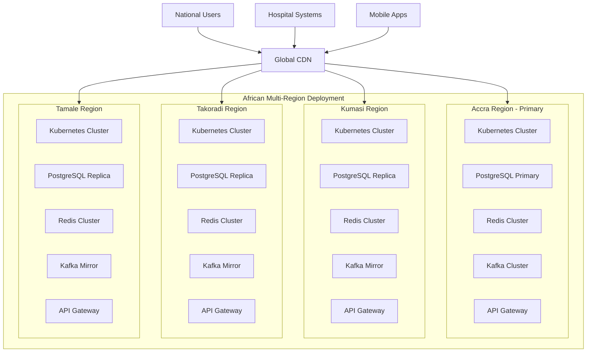

# Multi-Geo Infrastructure Design for National-Scale EMR System

## Executive Summary

This document presents a comprehensive multi-region deployment strategy for the EMR backend system, designed to support national-level scaling across Ghana and other African countries. The architecture leverages Kubernetes, PostgreSQL geo-sharding, Redis clustering, Kafka multi-region replication, and advanced networking to deliver low-latency, highly available, and compliant healthcare services.

## Current Architecture Analysis

### Existing Microservices
- **Auth Service**: User authentication and authorization
- **Patient Service**: Patient record management
- **Medical Record Service**: Medical data storage and retrieval
- **Sync Service**: Offline-first synchronization with conflict resolution
- **Hospital Integration Service**: Hospital system connectivity
- **Audit Service**: Compliance logging and monitoring
- **Notification Service**: Alerts and communications

### Current Infrastructure
- **Containerization**: Docker-based microservices
- **Orchestration**: Local Kubernetes development setup
- **Database**: Single-region PostgreSQL
- **Caching**: Single Redis instance
- **Messaging**: Single Kafka cluster
- **API Gateway**: Spring Cloud Gateway with local routing

## Multi-Geo Architecture Design

### 1. Regional Deployment Strategy



### 2. Kubernetes Multi-Region Deployment

#### Cluster Topology
- **Primary Region (Accra)**: Main control plane with full service deployment
- **Secondary Regions (Kumasi, Takoradi, Tamale)**: Regional clusters with service replicas
- **Active-Active Deployment**: All regions serve traffic with geo-aware routing

#### Kubernetes Configuration
```yaml
# Regional cluster configuration template
apiVersion: v1
kind: Namespace
metadata:
  name: mayo-emr
  labels:
    region: accra
    environment: production
    compliance: hipaa-gdpr

---

apiVersion: apps/v1
kind: Deployment
metadata:
  name: auth-service
  namespace: mayo-emr
spec:
  replicas: 3
  strategy:
    rollingUpdate:
      maxSurge: 1
      maxUnavailable: 0
    type: RollingUpdate
  template:
    spec:
      affinity:
        podAntiAffinity:
          requiredDuringSchedulingIgnoredDuringExecution:
          - labelSelector:
              matchExpressions:
              - key: app
                operator: In
                values:
                - auth-service
            topologyKey: "kubernetes.io/hostname"
      containers:
      - name: auth-service
        image: ghcr.io/mayo-emr/auth-service:2.1.0
        ports:
        - containerPort: 8081
        resources:
          requests:
            cpu: "500m"
            memory: "1Gi"
          limits:
            cpu: "2000m"
            memory: "4Gi"
        env:
        - name: REGION
          value: "accra"
        - name: PRIMARY_REGION
          value: "true"
        readinessProbe:
          httpGet:
            path: /actuator/health
            port: 8081
          initialDelaySeconds: 30
          periodSeconds: 10
        livenessProbe:
          httpGet:
            path: /actuator/health
            port: 8081
          initialDelaySeconds: 60
          periodSeconds: 20
```

### 3. Geo-Aware Load Balancing

#### Multi-Region Ingress Configuration
```yaml
apiVersion: networking.k8s.io/v1
kind: Ingress
metadata:
  name: mayo-ingress
  namespace: mayo-emr
  annotations:
    kubernetes.io/ingress.class: "gce"
    networking.gke.io/v1beta1.FrontendConfig: "geo-config"
    kubernetes.io/ingress.global-static-ip-name: "mayo-global-ip"
spec:
  rules:
  - host: api.mayo-health.gh
    http:
      paths:
      - path: /*
        pathType: ImplementationSpecific
        backend:
          service:
            name: gateway-service
            port:
              number: 80
```

#### Geo-Routing Configuration (GCP Example)
```yaml
apiVersion: networking.gke.io/v1beta1
kind: FrontendConfig
metadata:
  name: geo-config
spec:
  redirectToHttps:
    enabled: true
    responseCodeName: MOVED_PERMANENTLY_DEFAULT
  sslPolicy: "mayo-ssl-policy"
  customRequestHeaders:
    headers:
    - "X-Region:{client_region}"
```

### 4. PostgreSQL Geo-Sharding with Citus

#### Database Architecture
- **Primary Region (Accra)**: Citus coordinator + worker nodes
- **Secondary Regions**: Read replicas with local Citus workers
- **Sharding Strategy**: By geographic location (region-based sharding)

```sql
-- Citus sharding configuration
CREATE EXTENSION citus;

-- Create distributed tables with geo-based sharding
SELECT create_distributed_table('patients', 'region');
SELECT create_distributed_table('medical_records', 'patient_id', 'hash');
SELECT create_distributed_table('audit_logs', 'region');

-- Create reference tables
SELECT create_reference_table('hospitals');
SELECT create_reference_table('users');

-- Configure replication
SELECT master_add_kafka_partition('patients', 'kafka-broker:9092', 'patients-topic');
```

#### Multi-Region Replication Setup
```yaml
# PostgreSQL operator configuration for multi-region
apiVersion: postgres-operator.crunchydata.com/v1beta1
kind: PostgresCluster
metadata:
  name: mayo-postgres
  namespace: mayo-emr
spec:
  image: registry.developers.crunchydata.com/crunchydata/crunchy-postgres:ubi8-15.2-0
  postgresVersion: 15
  instances:
    - name: primary
      replicas: 3
      dataVolumeClaimSpec:
        accessModes:
        - "ReadWriteOnce"
        resources:
          requests:
            storage: 100Gi
      affinity:
        nodeAffinity:
          requiredDuringSchedulingIgnoredDuringExecution:
            nodeSelectorTerms:
            - matchExpressions:
              - key: topology.kubernetes.io/region
                operator: In
                values:
                - accra
  backups:
    pgbackrest:
      repos:
      - name: repo1
        volume:
          volumeClaimSpec:
            accessModes:
            - "ReadWriteOnce"
            resources:
              requests:
                storage: 100Gi
      global:
        repo1-retention-full: "7"
        repo1-retention-full-type: time
      manual:
        repoName: repo1
        options:
        - --type=full
```

### 5. Multi-Region Redis Clustering

#### Redis Enterprise Cluster Configuration
```yaml
apiVersion: app.redislabs.com/v1alpha1
kind: RedisEnterpriseCluster
metadata:
  name: mayo-redis
  namespace: mayo-emr
spec:
  nodes: 6
  redisEnterpriseNodeResources:
    limits:
      cpu: "4"
      memory: 8Gi
    requests:
      cpu: "2"
      memory: 4Gi
  bootstrapperImageSpec:
    imagePullPolicy: IfNotPresent
    repository: redislabs/operator
    version: 6.4.2-10
  podSecurityContext:
    runAsUser: 1000
    fsGroup: 1000
  priorityClassName: system-cluster-critical

---

apiVersion: app.redislabs.com/v1alpha1
kind: RedisEnterpriseDatabase
metadata:
  name: mayo-cache
  namespace: mayo-emr
spec:
  memorySize: 4GB
  redisEnterpriseCluster:
    name: mayo-redis
  replication: true
  clustering:
    enabled: true
    shardsCount: 3
    replicasPerShard: 2
  persistence:
    enabled: true
    aofPolicy: every-second
  multiRegionConfiguration:
    enabled: true
    regions:
    - name: accra
      priority: 1
    - name: kumasi
      priority: 2
    - name: takoradi
      priority: 3
    - name: tamale
      priority: 4
```

### 6. Kafka Multi-Region Replication

#### Multi-Cluster Kafka Architecture
```yaml
# Kafka MirrorMaker 2.0 Configuration
apiVersion: kafka.strimzi.io/v1beta2
kind: KafkaMirrorMaker2
metadata:
  name: mayo-kafka-mirror
  namespace: mayo-emr
spec:
  version: 3.4.0
  connectCluster: "accra-kafka"
  clusters:
  - alias: "accra"
    bootstrapServers: "accra-kafka-bootstrap:9092"
    config:
      config.storage.replication.factor: 3
      offset.storage.replication.factor: 3
      status.storage.replication.factor: 3
  - alias: "kumasi"
    bootstrapServers: "kumasi-kafka-bootstrap:9092"
    config:
      config.storage.replication.factor: 3
      offset.storage.replication.factor: 3
      status.storage.replication.factor: 3
  - alias: "takoradi"
    bootstrapServers: "takoradi-kafka-bootstrap:9092"
  - alias: "tamale"
    bootstrapServers: "tamale-kafka-bootstrap:9092"
  mirrors:
  - sourceCluster: "accra"
    targetCluster: "kumasi"
    sourceConnector:
      tasksMax: 4
      config:
        replication.factor: 3
        offset-syncs.topic.replication.factor: 3
        sync.topic.acls.enabled: "true"
        refresh.topics.interval.seconds: 60
        refresh.groups.interval.seconds: 60
  - sourceCluster: "accra"
    targetCluster: "takoradi"
  - sourceCluster: "accra"
    targetCluster: "tamale"
```

### 7. Geo-Aware API Gateway with Latency-Based Failover

#### Enhanced Gateway Configuration
```yaml
apiVersion: v1
kind: ConfigMap
metadata:
  name: gateway-config
  namespace: mayo-emr
data:
  application.yml: |
    server:
      port: 8080

    spring:
      application:
        name: gateway
      cloud:
        gateway:
          routes:
            - id: auth-service
              uri: lb://auth-service
              predicates:
                - Path=/api/auth/**
                - Weight=auth-service, 80
                - Weight=auth-service-kumasi, 10
                - Weight=auth-service-takoradi, 5
                - Weight=auth-service-tamale, 5
              filters:
                - name: Retry
                  args:
                    retries: 3
                    series: SERVER_ERROR
                    methods: GET,POST,PUT,DELETE
                    backoff:
                      firstBackoff: 10ms
                      maxBackoff: 500ms
                      factor: 2
                      basedOnPreviousValue: false
                - name: CircuitBreaker
                  args:
                    name: authServiceCircuitBreaker
                    fallbackUri: forward:/fallback/auth
                    statusCodes: 500,502,503,504
                    slidingWindowSize: 10
                    minimumNumberOfCalls: 5
                    permittedNumberOfCallsInHalfOpenState: 3
                    waitDurationInOpenState: 5s
                    failureRateThreshold: 50
                    slowCallRateThreshold: 50
                    slowCallDurationThreshold: 2s

          global-filters:
            - name: GeoRoutingFilter
              args:
                regionHeader: X-Region
                defaultRegion: accra
                regionMappings:
                  accra: lb://auth-service
                  kumasi: lb://auth-service-kumasi
                  takoradi: lb://auth-service-takoradi
                  tamale: lb://auth-service-tamale

    # Multi-region service discovery
    eureka:
      client:
        service-url:
          defaultZone: http://eureka-accra:8761/eureka/,http://eureka-kumasi:8761/eureka/,http://eureka-takoradi:8761/eureka/,http://eureka-tamale:8761/eureka/
        fetch-registry: true
        register-with-eureka: true
        registry-fetch-interval-seconds: 5
        availability-zones:
          accra: accra
          kumasi: kumasi
          takoradi: takoradi
          tamale: tamale
```

### 8. Data Residency and Compliance Framework

#### Regional Data Compliance Matrix
```yaml
apiVersion: v1
kind: ConfigMap
metadata:
  name: compliance-config
  namespace: mayo-emr
data:
  compliance-rules.yml: |
    regions:
      accra:
        country: GH
        regulations:
          - name: Ghana Data Protection Act 2012
            requirements:
              - data-residency: required
              - encryption-at-rest: required
              - encryption-in-transit: required
              - audit-logging: required
              - retention-period: 7 years
        allowed-cross-border: false
        backup-locations:
          - accra-secondary
          - kumasi

      kumasi:
        country: GH
        regulations:
          - name: Ghana Data Protection Act 2012
        allowed-cross-border: false
        backup-locations:
          - accra
          - kumasi-secondary

      takoradi:
        country: GH
        regulations:
          - name: Ghana Data Protection Act 2012
        allowed-cross-border: false

      tamale:
        country: GH
        regulations:
          - name: Ghana Data Protection Act 2012
        allowed-cross-border: false

    encryption:
      at-rest:
        algorithm: AES-256
        key-rotation: 90 days
      in-transit:
        tls-version: TLS 1.3
        cipher-suites:
          - TLS_AES_256_GCM_SHA384
          - TLS_CHACHA20_POLY1305_SHA256

    audit:
      logging:
        enabled: true
        retention: 7 years
        immutable-storage: true
      monitoring:
        real-time-alerts: true
        anomaly-detection: true
```

### 9. CDN Integration for API Acceleration

#### Cloudflare CDN Configuration
```yaml
# CDN configuration for multi-region acceleration
apiVersion: v1
kind: ConfigMap
metadata:
  name: cdn-config
  namespace: mayo-emr
data:
  cloudflare-config.json: |
    {
      "zones": [
        {
          "id": "mayo-health-zone",
          "name": "api.mayo-health.gh",
          "status": "active",
          "paused": false,
          "settings": {
            "ssl": "full_strict",
            "min_tls_version": "1.2",
            "opportunistic_encryption": true,
            "always_online": true,
            "development_mode": false,
            "cache_level": "aggressive",
            "browser_cache_ttl": 31536000,
            "challenge_ttl": 1800,
            "minify": {
              "css": true,
              "js": true,
              "html": true
            },
            "mobile_redirect": {
              "enabled": false
            },
            "security_level": "high",
            "broker_select": {
              "enabled": true,
              "regions": ["WNAM", "ENAM", "WEU", "EEU", "APAC", "AFRICA"]
            }
          },
          "load_balancing": {
            "enabled": true,
            "proxied": true,
            "ttl": 30,
            "fallback_pool": "accra-primary",
            "default_pools": ["accra-primary", "kumasi-primary", "takoradi-primary", "tamale-primary"],
            "region_pools": {
              "AFRICA": {
                "GH": ["accra-primary", "kumasi-primary", "takoradi-primary", "tamale-primary"],
                "NG": ["accra-primary", "kumasi-primary"],
                "KE": ["accra-primary", "takoradi-primary"]
              },
              "EUROPE": {
                "GB": ["accra-primary"],
                "DE": ["accra-primary"]
              }
            },
            "session_affinity": "cookie",
            "session_affinity_ttl": 1800,
            "steering_policy": "dynamic_latency"
          },
          "argo": {
            "tiered_caching": true,
            "smart_routing": true,
            "enabled": true
          },
          "cache_rules": [
            {
              "pattern": "api.mayo-health.gh/api/*",
              "features": {
                "cache": true,
                "cache_ttl": 300,
                "cache_key": "ignore-query-string",
                "edge_cache_ttl": 60,
                "bypass_cache_on_cookie": "sessionid"
              }
            },
            {
              "pattern": "api.mayo-health.gh/static/*",
              "features": {
                "cache": true,
                "cache_ttl": 86400,
                "edge_cache_ttl": 3600,
                "bypass_cache_on_cookie": "none"
              }
            }
          ]
        }
      ]
    }
```

### 10. Monitoring and Observability

#### Multi-Region Monitoring Stack
```yaml
# Prometheus Federation Configuration
apiVersion: monitoring.coreos.com/v1
kind: Prometheus
metadata:
  name: regional-prometheus
  namespace: monitoring
spec:
  serviceMonitorSelector:
    matchLabels:
      monitoring: regional
  podMonitorSelector:
    matchLabels:
      monitoring: regional
  resources:
    requests:
      memory: 4Gi
      cpu: 2
    limits:
      memory: 8Gi
      cpu: 4
  retention: 30d
  storage:
    volumeClaimTemplate:
      spec:
        storageClassName: ssd
        resources:
          requests:
            storage: 200Gi
  thanos:
    image: quay.io/thanos/thanos:v0.32.0
    objectStorageConfig:
      key: thanos.yaml
      name: thanos-config
    grpc:
      address: 0.0.0.0
      port: 10901
    http:
      address: 0.0.0.0
      port: 10902

---

# Grafana Multi-Region Dashboard
apiVersion: v1
kind: ConfigMap
metadata:
  name: grafana-dashboards
  namespace: monitoring
data:
  regional-health.json: |
    {
      "title": "Multi-Region Health Overview",
      "panels": [
        {
          "title": "Regional Latency",
          "type": "timeseries",
          "targets": [
            {
              "expr": "histogram_quantile(0.95, sum(rate(http_request_duration_seconds_bucket{job=\"gateway-service\"}[5m])) by (region, le))",
              "legendFormat": "{{region}} - 95th Percentile"
            }
          ],
          "yaxes": [
            {
              "format": "s",
              "label": "Latency"
            }
          ]
        },
        {
          "title": "Regional Error Rates",
          "type": "timeseries",
          "targets": [
            {
              "expr": "sum(rate(http_requests_total{job=\"gateway-service\", status=~\"5..\"}[5m])) by (region) / sum(rate(http_requests_total{job=\"gateway-service\"}[5m])) by (region)",
              "legendFormat": "{{region}} - Error Rate"
            }
          ],
          "yaxes": [
            {
              "format": "percentunit",
              "label": "Error Rate"
            }
          ]
        }
      ],
      "templating": {
        "list": [
          {
            "name": "region",
            "type": "query",
            "query": "label_values(http_requests_total, region)",
            "allValue": ".*",
            "includeAll": true
          }
        ]
      }
    }
```

### 11. Disaster Recovery and Backup Strategy

#### Multi-Region Backup Policy
```yaml
apiVersion: velero.io/v1
kind: Backup
metadata:
  name: daily-regional-backup
  namespace: velero
spec:
  includedNamespaces:
  - mayo-emr
  - monitoring
  excludedResources:
  - pods
  - events
  - events.events.k8s.io
  storageLocation: regional-backup-storage
  ttl: 168h0m0s
  schedule: "@every 24h"
  template:
    includedClusterScopedResources:
    - clusterroles
    - clusterrolebindings
    labelSelector:
      matchLabels:
        backup: enabled
    snapshotVolumes: true
    volumeSnapshotLocations:
    - regional-snapshot-location
    ttl: 336h0m0s

---

apiVersion: velero.io/v1
kind: BackupStorageLocation
metadata:
  name: regional-backup-storage
  namespace: velero
spec:
  provider: gcp
  objectStorage:
    bucket: mayo-emr-backups-accra
  config:
    serviceAccount: velero-service-account
    project: mayo-health-production
  backupSyncPeriod: 2m
  default: true

---

apiVersion: velero.io/v1
kind: VolumeSnapshotLocation
metadata:
  name: regional-snapshot-location
  namespace: velero
spec:
  provider: gcp
  config:
    project: mayo-health-production
    zone: africa-west1-a
```

### 12. Cost Optimization Strategy

#### Multi-Region Cost Management
```yaml
apiVersion: v1
kind: ConfigMap
metadata:
  name: cost-optimization
  namespace: mayo-emr
data:
  cost-strategy.yml: |
    # Regional Cost Optimization Strategy
    regions:
      accra:
        priority: primary
        cost-factor: 1.0
        spot-instance-usage: 30%
        reserved-instances: 70%
        auto-scaling:
          min-replicas: 3
          max-replicas: 15
          scale-down-delay: 10m
          scale-up-delay: 2m

      kumasi:
        priority: secondary
        cost-factor: 0.95
        spot-instance-usage: 50%
        reserved-instances: 50%
        auto-scaling:
          min-replicas: 2
          max-replicas: 10
          scale-down-delay: 5m
          scale-up-delay: 1m

      takoradi:
        priority: secondary
        cost-factor: 0.9
        spot-instance-usage: 60%
        reserved-instances: 40%
        auto-scaling:
          min-replicas: 2
          max-replicas: 8

      tamale:
        priority: tertiary
        cost-factor: 0.85
        spot-instance-usage: 70%
        reserved-instances: 30%
        auto-scaling:
          min-replicas: 1
          max-replicas: 6

    # Resource Optimization
    resource-management:
      vertical-pod-autoscaler:
        enabled: true
        update-mode: "Auto"
        recommendations:
          - container: ".*-service"
            min-cpu: "250m"
            max-cpu: "4000m"
            min-memory: "512Mi"
            max-memory: "8Gi"

      horizontal-pod-autoscaler:
        cpu-target: 70%
        memory-target: 80%
        stabilization-window: 5m

    # Data Transfer Optimization
    data-transfer:
      inter-region:
        compression: gzip
        batch-size: 1000
        batch-interval: 5s
      cross-region-replication:
        schedule: "0 2 * * *"  # During off-peak hours
        bandwidth-limit: 100Mbps
        priority-topics:
          - "patient-records"
          - "audit-logs"
          - "sync-events"

    # Storage Optimization
    storage:
      tiered-storage:
        hot-tier: 7d
        warm-tier: 30d
        cold-tier: 90d
        archive-tier: 365d
      compression:
        enabled: true
        algorithm: zstd
        level: 6
```

## Phase 2 Features Support

### Family Accounts and Transfers
- **Geo-Aware Family Management**: Family data sharded by primary region
- **Cross-Region Transfers**: Asynchronous replication with conflict resolution
- **Data Locality**: Family records stored in primary user's region

### Audit and Compliance
- **Regional Audit Trails**: Separate audit logs per region with cross-region aggregation
- **Compliance Automation**: Regional-specific rule enforcement
- **Immutable Logging**: Write-once storage with cryptographic hashing

### Notifications
- **Regional Notification Hubs**: Localized notification processing
- **Geo-Targeted Alerts**: Region-specific notification routing
- **Multi-Channel Delivery**: SMS, email, and push with regional preferences

### CRDTs Implementation
- **Regional Conflict Resolution**: CRDT-based merge strategies
- **Multi-Region Sync**: Eventual consistency with regional priority
- **Offline-First**: Enhanced delta sync with regional awareness

## Implementation Roadmap

### Phase 1: Foundation (3-6 months)
- [ ] Multi-region Kubernetes cluster setup
- [ ] Basic PostgreSQL replication
- [ ] Regional Redis caching
- [ ] Cross-region Kafka mirroring
- [ ] Geo-aware API gateway routing

### Phase 2: Scaling (6-12 months)
- [ ] Advanced data sharding with Citus
- [ ] Multi-region CRDT implementation
- [ ] Regional compliance automation
- [ ] CDN integration and optimization
- [ ] Enhanced monitoring and observability

### Phase 3: Optimization (12-18 months)
- [ ] Cost optimization strategies
- [ ] Disaster recovery testing
- [ ] Performance tuning
- [ ] Security hardening
- [ ] Regulatory certification

## Operational Runbooks

### Regional Failover Procedure
1. **Detection**: Monitoring alerts on regional outage
2. **Traffic Shift**: CDN reroutes to nearest healthy region
3. **Database Promotion**: Secondary region promoted to primary
4. **Service Scaling**: Increase replicas in healthy regions
5. **Communication**: Notify stakeholders and users
6. **Recovery**: Restore failed region and resync data

### Data Residency Compliance Check
1. **Audit**: Run compliance scan on regional data
2. **Validation**: Verify encryption and access controls
3. **Reporting**: Generate compliance report
4. **Remediation**: Address any violations
5. **Certification**: Submit for regulatory approval

## Conclusion

This multi-geo infrastructure design provides a comprehensive foundation for national-scale EMR deployment. The architecture ensures low-latency access, high availability, regulatory compliance, and cost-effective operations while supporting all Phase 2 features including family accounts, advanced auditing, notifications, and CRDT-based conflict resolution.